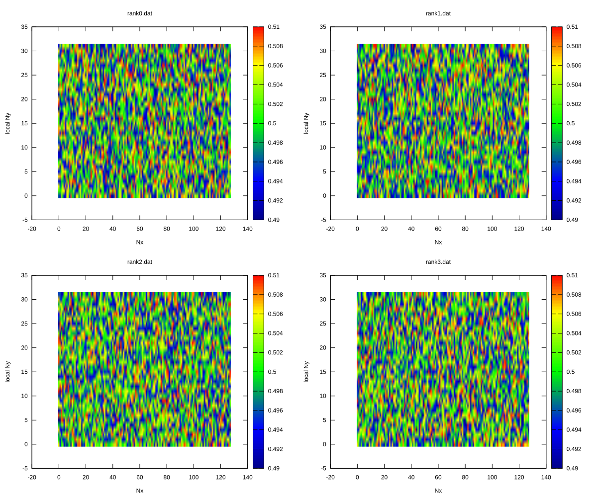
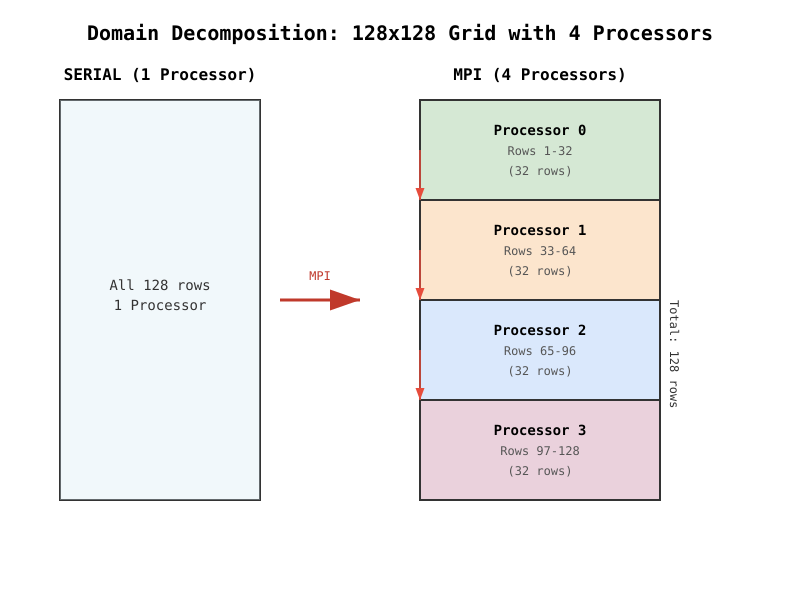
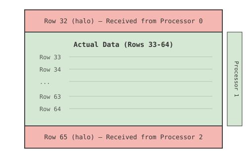
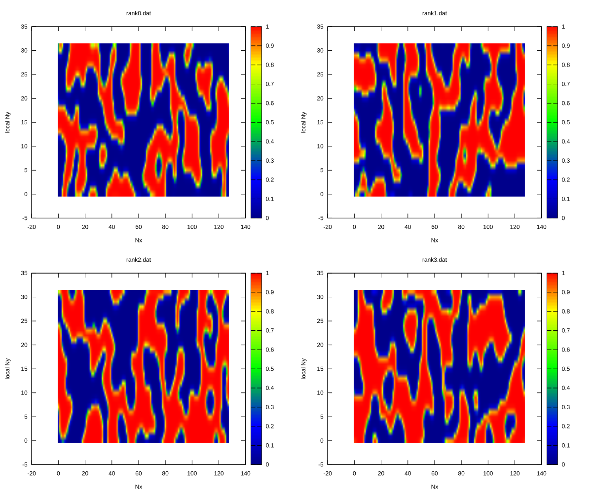
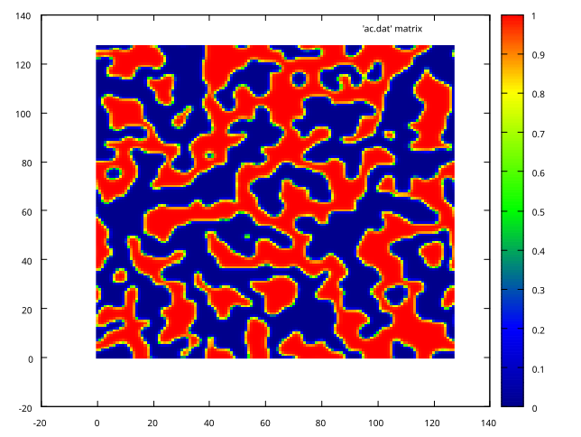

# MPI Implementation in the Phase Field Code

This repository provides parallel implementations of phase-field models using the Message Passing Interface (MPI) for distributed-memory computations. The codes are designed for large-scale materials science simulations and are organized by model type with a consistent infrastructure for performance testing and data collection.

The documentation is organized into two sections. The first section provides a comprehensive description of the MPI model implementations employed across the simulation codes, detailing the parallelization strategy and key algorithmic features. The second section outlines the repository structure and presents the necessary instructions for compiling, executing, and managing simulation workflows.



# Part 1:  What is MPI and Why Use It?

MPI (Message Passing Interface) allows a program to run on multiple processors simultaneously. Each processor (or "rank") works on a portion of the problem, and they communicate with each other when needed. This is essential when your simulation domain is too large for a single processor.

## The Domain Decomposition Strategy

### Serial Approach

In the serial code, the entire computational grid is a single 2D array:

```fortran
real (kind=8), dimension(Nx, Ny) :: phi, dfdphi, lap_phi
```

The code processes all `Nx*Ny` points in nested loops:
- Outer loop over `i` (1 to Nx)
- Inner loop over `j` (1 to Ny)

### MPI Approach

The key idea is to **divide the domain along one direction** (y-direction in our case). Each MPI rank gets a horizontal slice of the grid:

```fortran
integer :: local_Ny, start_y, end_y

local_Ny = Ny / nprocs    ! Number of rows each processor handles
start_y  = rank * local_Ny + 1
end_y    = merge(Ny, start_y + local_Ny - 1, rank == nprocs - 1)
local_Ny = end_y - start_y + 1
```



#### How the Code Calculates Each Processor's Slice
```
Processor 0 (rank=0):
    local_Ny = 128/4 = 32        ← Each processor gets 32 rows
    start_y  = 0*32 + 1 = 1      ← Starts at row 1
    end_y    = 1+32-1 = 32       ← Ends at row 32
    local_Ny = 32-1+1 = 32       ← Final size

Processor 1 (rank=1):
    local_Ny = 128/4 = 32
    start_y  = 1*32 + 1 = 33
    end_y    = 33+32-1 = 64
    local_Ny = 64-33+1 = 32

Processor 2 (rank=2):
    local_Ny = 128/4 = 32
    start_y  = 2*32 + 1 = 65
    end_y    = 65+32-1 = 96
    local_Ny = 96-65+1 = 32

Processor 3 (rank=3):
    local_Ny = 128/4 = 32
    start_y  = 3*32 + 1 = 97
    end_y    = merge(Ny, 97+32-1, rank==3)
             = merge(128, 128, TRUE)
             = 128                    ← Special handling for last processor!
    local_Ny = 128-97+1 = 32
```    
**The Special Case: Last Processor**

Notice the merge function handles any remainder rows: The merge function ensures the last processor gets all remaining rows:
`end_y = merge(Ny, start_y + local_Ny - 1, rank == nprocs - 1)`. if rank is last, use `Ny (130)`, otherwise use `start_y+local_Ny-1`

## The Halo Exchange - Critical for Performance

### Why Do We Need Halos?

When computing the Laplacian at point `(i,j)`, we need neighboring points `(i,j+1)` and `(i,j-1)`. For points at the boundary of a processor's slice, these neighbors might belong to another processor.

Here's the Laplacian calculation from the code:
```fortran
lap_phi(i,j) = ( phi(ip,j) + phi(im,j) + phi(i,jm) + phi(i,jp) - 4.0*phi(i,j) ) / (dx * dy)
```

To compute this at the edge of our domain, we need data from neighboring ranks.

### Implementing Halos



Each rank allocates extra rows (halos) at the top and bottom:

```fortran
allocate(phi(1:Nx, 0:local_Ny+1))
```

The actual computational domain is rows `1` to `local_Ny`, while:
- Row `0` is the halo from the processor below
- Row `local_Ny+1` is the halo from the processor above

### The Halo Exchange Process

In each time step, before computing derivatives, we exchange boundary data:

```fortran
! Send bottom row to processor below, receive top halo from processor above
call MPI_Sendrecv( &
    phi(1,1), Nx, MPI_DOUBLE_PRECISION, down, 0, &
    phi(1,local_Ny+1), Nx, MPI_DOUBLE_PRECISION, up, 0, &
    MPI_COMM_WORLD, status, ierr)

! Send top row to processor above, receive bottom halo from processor below
call MPI_Sendrecv( &
    phi(1,local_Ny), Nx, MPI_DOUBLE_PRECISION, up, 1, &
    phi(1,0), Nx, MPI_DOUBLE_PRECISION, down, 1, &
    MPI_COMM_WORLD, status, ierr)
```

Let's visualize this:
```
Rank 0 (rows 1-32):     Send row 32 → Rank 1
                        Receive row 33 → halo row 33
                        
Rank 1 (rows 33-64):    Receive row 32 → halo row 0
                        Send row 33 → Rank 0
```

## Key Steps in the Porting Process

### Step 1: Identify the Communication Pattern

**Serial code:**
```fortran
! Each point needs neighbors in all directions
lap_phi(i,j) = ( phi(ip,j) + phi(im,j) + phi(i,jm) + phi(i,jp) - 4.0*phi(i,j) ) / (dx*dy)
```

**MPI code:**
- Points in the interior of each slice are computed locally
- Points at boundaries need data from neighbors (halo exchange)

### Step 2: Modify Array Allocations

**Serial:**
```fortran
real(kind=8), dimension(Nx, Ny) :: phi
```

**MPI:**
```fortran
! Allocate with halo rows
allocate(phi(1:Nx, 0:local_Ny+1))
```

### Step 3: Initialize Only Local Data

**Serial:**
```fortran
phi = phi_0 + noise*(0.5 - r)  ! Full array
```

**MPI:**
```fortran
! Initialize only the local portion
do j = 1, local_Ny
    do i = 1, Nx
        call random_number(r)
        phi(i, j) = phi_0 + noise * (0.5d0 - r)
    end do
end do
```
**Note: The initial microstructure for each rank is shown at the begining of the file.**
### Step 4: Add Communication Before Derivative Calculation

**Serial:**
```fortran
! Direct calculation
dfdphi(i,j) = A*(2.0*phi(i,j)*(1.0-phi(i,j))**2*(1.0-2*phi(i,j)))
```

**MPI:**
```fortran
! Exchange halos first
call MPI_Sendrecv(...)  ! Row 1 ↔ Halo from below
call MPI_Sendrecv(...)  ! Row local_Ny ↔ Halo from above

! Then calculate derivatives
dfdphi(i,j) = A * (2.0d0 * phi(i,j) * (1.0d0 - phi(i,j)) * (1.0d0 - phi(i,j)) -  2.0d0 * phi(i,j) * phi(i,j) * (1.0d0 - phi(i,j)))
```
After the evolution finishes. The final microstructure at each rank.


### Step 5: Gather Results to Main Node

After the simulation completes, all data is gathered to rank 0 for output:

```fortran
if (rank == 0) then
    ! Main rank collects data from all processors
    allocate(full_phi(1:Nx, 1:Ny))
    
    ! First, add its own data
    do j = 1, local_Ny
        full_phi(:, j) = phi(:, j)
    end do
    
    ! Then receive from other ranks
    do p = 1, nprocs - 1
        call MPI_Recv(recv_buf, p_local_Ny * Nx, MPI_DOUBLE_PRECISION, p, 0, MPI_COMM_WORLD, status, ierr)
        ! Place received data in correct location
    end do
else
    ! Other ranks send their data to main
    call MPI_Send(send_buf, local_Ny * Nx, MPI_DOUBLE_PRECISION, 0, 0, &
                  MPI_COMM_WORLD, ierr)
end if
```
After results are gathered, the final result shows the microstructure over the whole domain.


## Summary: Porting Strategy Checklist

1. **Analyze Dependencies**: Identify which neighboring points are needed for computations
2. **Choose Decomposition Direction**: Split along the direction with the simplest communication (we chose y-direction)
3. **Allocate with Halos**: Add extra ghost cells at boundaries
4. **Add Communication**: Exchange halo data before each step that needs it
5. **Adjust Loop Bounds**: Process only local data, use halos for boundary points
6. **Handle I/O**: Gather data to master rank for writing output
7. **Initialize MPI**: Set up MPI environment at start and end

## Performance Considerations

- **Communication Overhead**: Minimize data transfer by using MPI_Sendrecv instead of separate sends/receives
- **Load Balancing**: Ensure work is evenly distributed (we divided Ny equally)
- **Local Computation**: Most of the work is still the same as serial code
- **Scalability**: The cost of communication grows with the number of processors

## The Beauty of This Approach

The MPI version is remarkably similar to the serial version. The core physics calculations (dfdphi, laplacian, time integration) remain almost identical. Only the data management and communication parts are new. This makes MPI relatively easy to implement for existing codes!

The main differences are:
1. Arrays with halos
2. Communication calls
3. Modified loop bounds
4. Result gathering

Everything else—the physics, the numerical scheme, the time stepping—stays exactly the same!


# Part 2: MPI Phase-Field Codes

This repository contains parallel MPI implementations of phase-field models for materials science simulations. The codes are organized by model type and follow a consistent structure for grid sweeps and performance testing.

## Directory Structure

```
mpi/
├── ReadMe.md              # This file
├── images/                # Contains visualization outputs
├── model_A/               # Allen-Cahn equation (Model A)
│   ├── main.f90           # MPI implementation
│   ├── run_grid_sweep.sh  # Batch script for grid size sweeps
│   ├── ac.dat             # Output data file
│   ├── subplots.gp        # Gnuplot script for visualization
│   └── grid_sweep_results/# Results from grid sweeps
├── model_B/               # Cahn-Hilliard equation (Model B)
│   ├── main.f90           # MPI implementation
│   ├── run_grid_sweep.sh  # Batch script for grid size sweeps
│   └── grid_sweep_results/# Results from grid sweeps
└── model_C/               # Model C (Cahn-Hilliard + Allen-Cahn coupled)
    ├── main.f90           # MPI implementation
    ├── run_grid_sweep.sh  # Batch script for grid size sweeps
    └── grid_sweep_results/# Results from grid sweeps
```

## Model Descriptions

- **Model A**: Allen-Cahn equation (phase-field evolution without conservation)
- **Model B**: Cahn-Hilliard equation (phase-field evolution with conservation)
- **Model C**: Coupled Cahn-Hilliard and Allen-Cahn equations (two-field model)

## Prerequisites

- **Fortran Compiler**: `mpif90` (MPI-enabled Fortran compiler)
- **MPI**: OpenMPI or MPICH implementation
- **Optional**: `gnuplot` for visualization (if using `subplots.gp`)

## Compilation and Running

### Single Run

Navigate to the desired model directory and run:

```bash
cd model_A
mpif90 -std=gnu main.f90 -O2 -o main
mpirun -np 4 ./main
```

### Grid Size Sweep

Each model directory contains a `run_grid_sweep.sh` script that automatically compiles and runs the code for multiple grid sizes:

```bash
cd model_A
./run_grid_sweep.sh          # Runs default sizes: 64, 128, 256, 512, 1024
./run_grid_sweep.sh 128 256  # Run specific sizes only
```

The script will:
1. Create a `grid_sweep_results/` directory
2. For each grid size N:
   - Generate a modified source file with Nx = Ny = N
   - Compile the code
   - Run the simulation
   - Save output data as `ch_ac_NN.dat` (or `ac_NN.dat` for Model A)
   - Save timing logs as `log_NN.txt`

### MPI Configuration

The number of MPI ranks is set by the `NP` variable in the `run_grid_sweep.sh` script. By default, it uses 1 rank:

```bash
NP=1                    # Change to desired number of ranks
```

For production runs, modify this value to match your system's configuration.

## Output Files

### Model A (Allen-Cahn)
- `ac.dat`: Final concentration field (Nx × Ny grid)

### Model B (Cahn-Hilliard)
- `ch.dat`: Final concentration field (Nx × Ny grid)

### Model C (Coupled)
- `ch_ac.dat`: Final concentration field (Nx × Ny grid)

### Grid Sweep Results
All results are stored in `grid_sweep_results/` with naming:
- `ch_ac_NNN.dat` (or `ac_NNN.dat`): Data for size N×N
- `log_NNN.txt`: Timing and console output for size N×N

## Visualization

Model A includes a `subplots.gp` gnuplot script for visualizing results:

```bash
gnuplot subplots.gp
```

For other models, you can create similar visualization scripts or use your preferred data visualization tools.

## References

- Original serial implementations by Shahid Maqbool
- MPI parallelization based on the serial reference at: https://github.com/Shahid718/Programming-Phase-field-in-Fortran

## License

This code is provided as-is for educational and research purposes.
